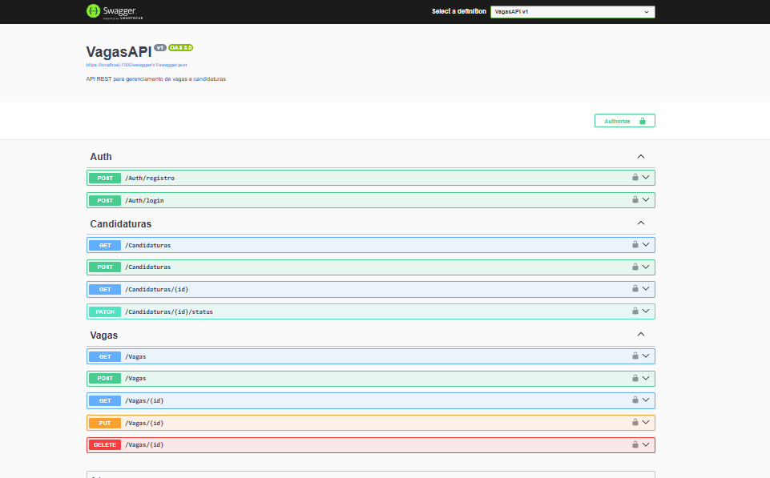
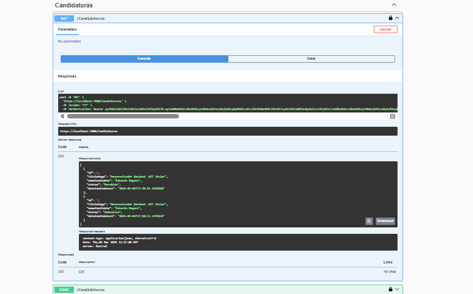

# VagasAPI





> API REST completa para gerenciamento de vagas de emprego e candidaturas, com autenticação JWT, perfis de acesso e pipeline de status.

---

## 💡 Sobre o Projeto

O mercado de recrutamento envolve dois lados: empresas que publicam vagas e candidatos que se inscrevem nelas. A **VagasAPI** resolve esse fluxo de ponta a ponta em uma API estruturada e segura.

O projeto foi desenvolvido como portfólio de back-end .NET, aplicando na prática os conceitos usados no mercado:

- **Arquitetura em camadas** com separação clara de responsabilidades
- **Autenticação e autorização** com JWT e perfis distintos (Admin / Candidato)
- **Pipeline de candidaturas** com controle de status
- **Injeção de dependência** em toda a aplicação
- **Middleware de tratamento de erros** centralizado
- **Logs estruturados** com ILogger
- **DTOs** para separar contratos da API das entidades do banco
- **Migrations** para versionamento do banco de dados

---

## 🚀 Tecnologias

- **C# / .NET 8**
- **ASP.NET Core** — Web API
- **Entity Framework Core** — ORM
- **SQL Server Express** — Banco de dados relacional
- **JWT (JSON Web Token)** — Autenticação e autorização
- **Swagger / OpenAPI** — Documentação interativa

---

## 🏗️ Arquitetura
```
Controller  →  Service  →  Repository  →  Banco de Dados
```

| Camada | Responsabilidade |
|--------|-----------------|
| **Controller** | Recebe requisições HTTP, valida permissões e retorna respostas |
| **Service** | Contém as regras de negócio da aplicação |
| **Repository** | Responsável exclusivamente pelo acesso ao banco de dados |
| **DTOs** | Definem os contratos de entrada e saída da API |
| **Models** | Representam as entidades mapeadas no banco de dados |

---

## 🗂️ Estrutura do Projeto
```
VagasAPI/
├── Controllers/
│   ├── AuthController.cs
│   ├── VagasController.cs
│   └── CandidaturasController.cs
├── Data/
│   └── AppDbContext.cs
├── DTOs/
│   ├── LoginDto.cs
│   ├── RegistroDto.cs
│   ├── VagaDto.cs
│   ├── CandidaturaDto.cs
│   └── PagedResultDto.cs
├── Models/
│   ├── Usuario.cs
│   ├── Vaga.cs
│   ├── Candidato.cs
│   └── Candidatura.cs
├── Repositories/
│   ├── IVagaRepository.cs
│   ├── VagaRepository.cs
│   ├── ICandidaturaRepository.cs
│   └── CandidaturaRepository.cs
├── Services/
│   ├── IVagaService.cs
│   ├── VagaService.cs
│   ├── ICandidaturaService.cs
│   └── CandidaturaService.cs
├── Migrations/
├── appsettings.example.json
└── Program.cs
```

---

## 🔐 Autenticação e Perfis

A API utiliza **JWT Bearer Token** com dois perfis de acesso:

| Perfil | Permissões |
|--------|-----------|
| **Admin** | Criar vagas, listar todas as candidaturas, atualizar status das candidaturas |
| **Candidato** | Se candidatar a vagas, consultar candidaturas |

---

## 📋 Endpoints

### Auth
| Método | Rota | Descrição | Acesso |
|--------|------|-----------|--------|
| POST | `/Auth/registro` | Registra novo usuário | Público |
| POST | `/Auth/login` | Realiza login e retorna JWT | Público |

### Vagas
| Método | Rota | Descrição | Acesso |
|--------|------|-----------|--------|
| GET | `/Vagas` | Lista todas as vagas | Autenticado |
| POST | `/Vagas` | Cria nova vaga | Admin |

### Candidaturas
| Método | Rota | Descrição | Acesso |
|--------|------|-----------|--------|
| GET | `/Candidaturas` | Lista todas as candidaturas | Admin |
| GET | `/Candidaturas/{id}` | Busca candidatura por ID | Autenticado |
| POST | `/Candidaturas` | Cria nova candidatura | Candidato |
| PATCH | `/Candidaturas/{id}/status` | Atualiza status da candidatura | Admin |

---

## 🔄 Pipeline de Candidaturas

Uma candidatura percorre o seguinte fluxo de status:
```
Recebida → EmAnalise → Entrevista → Aprovado
                                  ↘ Reprovado
```

Apenas usuários com perfil **Admin** podem avançar o status — refletindo o fluxo real de um processo seletivo.

---

## 🗄️ Banco de Dados

4 tabelas com relacionamentos:
```
Usuarios ──── Candidatos ──── Candidaturas ──── Vagas
```

| Tabela | Campos principais |
|--------|------------------|
| **Usuarios** | Id, Nome, Email, SenhaHash, Perfil |
| **Vagas** | Id, Titulo, Descricao, Area, Cidade, Modalidade, Salario, Ativa |
| **Candidatos** | Id, UsuarioId (FK), Telefone, LinkedIn |
| **Candidaturas** | Id, VagaId (FK), CandidatoId (FK), Status, DataCandidatura |

---

## ⚙️ Como executar localmente

### Pré-requisitos
- .NET 8 SDK
- SQL Server Express
- Visual Studio 2022+ ou VS Code

### Passo a passo

**1. Clone o repositório**
```bash
git clone https://github.com/degasdegani/VagasAPI.git
cd VagasAPI
```

**2. Configure o appsettings.json**

Copie o arquivo de exemplo:
```bash
cp appsettings.example.json appsettings.json
```

Edite com sua connection string e uma chave JWT segura:
```json
{
  "ConnectionStrings": {
    "DefaultConnection": "Server=localhost\\SQLEXPRESS;Database=VagasApiDb;Trusted_Connection=True;TrustServerCertificate=True"
  },
  "Jwt": {
    "Key": "SUA-CHAVE-SECRETA-AQUI",
    "Issuer": "VagasAPI",
    "Audience": "VagasAPI"
  }
}
```

**3. Execute as Migrations**
```bash
dotnet ef database update
```

**4. Rode o projeto**
```bash
dotnet run
```

**5. Acesse o Swagger**
```
https://localhost:7000/swagger
```

---

## 🧪 Testando a API

**1.** Registre um Admin via `POST /Auth/registro`:
```json
{
  "nome": "Admin",
  "email": "admin@vagasapi.com",
  "senha": "admin123",
  "perfil": "Admin"
}
```

**2.** Faça login via `POST /Auth/login` e copie o token retornado.

**3.** Clique em **Authorize** no Swagger e cole: `Bearer SEU_TOKEN`

**4.** Crie uma vaga, registre um candidato e teste o pipeline completo de candidaturas.

---

## 📌 Próximas melhorias

- [ ] Testes unitários com xUnit e Moq
- [ ] Filtros avançados e paginação nas listagens
- [ ] Endpoint para candidato visualizar suas próprias candidaturas
- [ ] Deploy na nuvem (Azure App Service)

---

## 👨‍💻 Autor

**Eduardo Degani**
Desenvolvedor Back-end .NET em transição de carreira, com experiência comercial e foco em construir soluções sólidas e bem estruturadas.

[](https://www.linkedin.com/in/eduardo-degani/)
[](https://github.com/degasdegani)